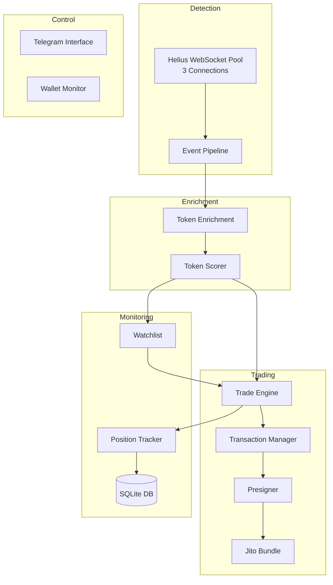

# Invictus Sniper Bot - Comprehensive Security & Trading Logic Analysis

**Date:** December 9, 2024  
**Scope:** Complete codebase review of Invictus Solana sniper bot  
**Files Reviewed:** 20+ source files (~10,000 lines of Rust code)

---

## Executive Summary

Invictus is a Solana sniper bot designed to detect and trade **graduated tokens** (primarily from Pump.fun bonding curve migrations). The architecture is well-structured with clear separation of concerns, but contains **several critical vulnerabilities** and **design weaknesses** that could lead to **financial losses** or **security breaches**.

> [!CAUTION]
> This bot handles **real cryptocurrency transactions**. The vulnerabilities identified below could result in **significant financial loss**. Do not deploy to mainnet without addressing the critical issues.

---

## Architecture Overview



---

## Critical Vulnerabilities

### 1. 🔴 Private Key Exposure in Memory

**File:** [presigner.rs](file:///home/oke-ayomide-peter/Desktop/WorkSpace/Invictus/src/presigner.rs#L40-L46)

```rust
let keypair = if std::path::Path::new(&config.private_key).exists() {
    solana_sdk::signature::read_keypair_file(&config.private_key)
        .expect("Failed to read keypair file")
} else {
    Keypair::from_base58_string(&config.private_key)
};
let keypair = Arc::new(keypair);
```

**Issue:** The private key is loaded directly from environment or file and stored in memory without protection. No zeroization occurs when the keypair is dropped.

**Risk:** Memory dumps, core dumps, or debugging could expose the private key.

**Recommendation:**

- Use `secrecy` crate with `SecretVec` for key material
- Implement `Zeroize` on drop
- Consider hardware wallet integration (Ledger) for production

---

### 2. 🔴 No Bundle Confirmation Verification

**File:** [trade_engine.rs](file:///home/oke-ayomide-peter/Desktop/WorkSpace/Invictus/src/trade_engine.rs#L70-L78)

```rust
// 4. Send Jito Bundle
let bundle_id = self.presigner.send_jito_bundle(vec![buy_tx, tip_tx]).await?;
info!("🚀 Buy Bundle Sent! ID: {}", bundle_id);

// 5. Wait for Confirmation (Optimistic for now, real verification needed)
tokio::time::sleep(tokio::time::Duration::from_secs(5)).await;
```

**Issue:** After sending a Jito bundle, the code only waits 5 seconds without verifying if the bundle actually landed on-chain. The bundle could fail silently.

**Risk:**

- Bot records trades that never executed
- Position tracker monitors non-existent positions
- Database state becomes inconsistent

**Recommendation:**

```rust
// Verify bundle landed
let bundle_status = self.presigner.get_bundle_status(&bundle_id).await?;
if bundle_status != BundleStatus::Landed {
    return Err(anyhow!("Bundle failed to land: {:?}", bundle_status));
}
```

---

### 3. 🔴 Token Balance Estimation Fallback to Zero

**File:** [trade_engine.rs](file:///home/oke-ayomide-peter/Desktop/WorkSpace/Invictus/src/trade_engine.rs#L82-L89)

```rust
let token_amount = match self.presigner.get_token_balance(&token.mint).await {
    Ok(amount) => amount,
    Err(e) => {
        warn!("Failed to fetch token balance for {}: {}. Using estimate.", token.mint, e);
        0  // ⚠️ DANGEROUS: Falls back to 0
    }
};
```

**Issue:** If token balance fetch fails, the bot uses `0` as the token amount. This corrupts all subsequent calculations.

**Risk:**

- Entry price calculations become infinite or NaN
- Position monitoring fails
- P/L calculations are meaningless

---

### 4. 🔴 Race Condition in Active Positions Map

**File:** [position_tracker.rs](file:///home/oke-ayomide-peter/Desktop/WorkSpace/Invictus/src/position_tracker.rs#L134-L138)

```rust
let position_for_map = position.clone();
tokio::spawn(async move {
    let mut guard = active_positions.lock().await;
    guard.insert(mint.clone(), position_for_map);
});
```

**Issue:** Position insertion is spawned as a separate task without waiting. The main function continues, potentially allowing trades on the same token before it's registered as active.

**Risk:** Risk checks in `main.rs` may not see the position, allowing duplicate buys.

**Recommendation:** Use `.await` directly or use an unbounded channel for atomic updates.

---

### 5. 🟠 No Slippage Protection on Sell

**File:** [trade_engine.rs](file:///home/oke-ayomide-peter/Desktop/WorkSpace/Invictus/src/trade_engine.rs#L115)

```rust
let slippage_bps = self.config.auto_sell_slippage_bps; // Default: 300 (3%)
```

**Issue:** While configurable, 3% slippage on sells during volatile market conditions (which sniper bot tokens frequently experience) could result in significant losses.

**Risk:** During panic sells or rug pulls, 3% slippage may not be enough, leading to failed transactions when you need them most.

---

## Security Vulnerabilities

### 6. 🔴 SQL Injection Potential

**File:** [db.rs](file:///home/oke-ayomide-peter/Desktop/WorkSpace/Invictus/src/db.rs)

While the code uses parameterized queries with `.bind()` (which is safe), there's no input validation on mint addresses or other user-influenced data before storage.

**Current (Safe):**

```rust
.bind(&token.mint)
```

**Recommendation:** Add validation layer:

```rust
fn validate_mint(mint: &str) -> Result<()> {
    if mint.len() != 44 || !mint.chars().all(|c| c.is_alphanumeric()) {
        return Err(anyhow!("Invalid mint address format"));
    }
    Ok(())
}
```

---

### 7. 🟠 Telegram Chat ID Authentication Weakness

**File:** [tele.rs](file:///home/oke-ayomide-peter/Desktop/WorkSpace/Invictus/src/tele.rs#L167-L170)

```rust
if msg.chat.id.0 != allowed_chat_id.0 {
    warn!("⚠️ Unauthorized access from chat ID: {}", msg.chat.id);
    return Ok(());
}
```

**Issue:** Only chat ID is checked. If the Telegram bot token is compromised, an attacker could potentially use a shared group or forwarded bot to execute commands.

**Risk:** The `/kill` command could be triggered by attackers.

**Recommendation:** Add command signing or two-factor confirmation for critical commands.

---

### 8. 🟠 Hardcoded Jito Tip Accounts

**File:** [tx.rs](file:///home/oke-ayomide-peter/Desktop/WorkSpace/Invictus/src/tx.rs#L27-L36)

```rust
const JITO_TIP_ACCOUNTS: [&str; 8] = [
    "96gYZGLnJYVFmbjzopPSU6QiEV5fGqZNyN9nmNhvrZU5",
    // ... 7 more
];
```

**Issue:** If Jito changes their tip accounts (which they have done before), bundles will fail silently.

**Recommendation:** Fetch tip accounts dynamically from Jito's API endpoint.

---

## Trading Logic Weaknesses

### 9. 🟠 Scorer Returns 0 for Low Liquidity (Not Negative)

**File:** [scoring.rs](file:///home/oke-ayomide-peter/Desktop/WorkSpace/Invictus/src/scoring.rs#L67-L71)

```rust
} else {
    // < 30 SOL is suspicious for a graduated token
    score += 0.0;
    warn!("    - LOW LIQUIDITY: {:.1} SOL", liquidity_sol);
}
```

**Issue:** Low liquidity adds 0 points instead of a penalty. Combined with other bonuses (metadata, holders), a low-liquidity token could still score above the watchlist threshold of 50.

**Risk:** Buying into illiquid tokens that can't be easily exited.

---

### 10. 🟠 Price Fetch Fallback in Position Tracker

**File:** [position_tracker.rs](file:///home/oke-ayomide-peter/Desktop/WorkSpace/Invictus/src/position_tracker.rs#L174-L177)

```rust
let final_price = match fetch_price_from_rpc(&client, &rpc_url, &position.mint).await {
    Ok(price) => price,
    Err(_) => position.entry_price_sol_per_token,  // Fallback to entry price
};
```

**Issue:** On timeout, the bot uses entry price as exit price, showing 0% P/L regardless of actual performance.

---

### 11. 🟠 No Duplicate Token Protection

**Files:** [main.rs](file:///home/oke-ayomide-peter/Desktop/WorkSpace/Invictus/src/main.rs), [watchlist.rs](file:///home/oke-ayomide-peter/Desktop/WorkSpace/Invictus/src/watchlist.rs)

**Issue:** No check exists to prevent the same token from being bought multiple times if it generates multiple pool creation events.

**Risk:** Buying the same token 2-3x during a pool migration that emits multiple events.

**Recommendation:**

```rust
// In main.rs before execute_buy:
if position_tracker.has_position(&token.mint).await {
    warn!("Already have position in {}, skipping", token.mint);
    continue;
}
```

---

### 12. 🟡 Watchlist Uses DexScreener (External Dependency)

**File:** [watchlist.rs](file:///home/oke-ayomide-peter/Desktop/WorkSpace/Invictus/src/watchlist.rs#L199-L229)

**Issue:** Price monitoring for dip-buying relies entirely on DexScreener API. If DexScreener is down or rate-limits, no buy signals will fire.

---

### 13. 🟡 Hardcoded Decimals

**File:** [trade_engine.rs](file:///home/oke-ayomide-peter/Desktop/WorkSpace/Invictus/src/trade_engine.rs#L159)

```rust
decimals: 6, // Default, should fetch
```

**Issue:** Position tracking assumes 6 decimals. Most Solana tokens use 9 or 6, but some use different values.

**Risk:** Incorrect token amount calculations by 1000x.

---

## Operational Weaknesses

### 14. 🟠 No Position Persistence Across Restarts

**File:** [trade_engine.rs](file:///home/oke-ayomide-peter/Desktop/WorkSpace/Invictus/src/trade_engine.rs#L205-L263)

While `resume_monitoring()` exists, several position fields are reset to defaults on restart:

```rust
partial_exit_executed: false, // Should store in DB
remaining_amount_pct: 100.0, // Should store in DB
```

**Risk:** Partial exits could be re-triggered after restart.

---

### 15. 🟡 Unbounded Cache Growth

**File:** [enrichment.rs](file:///home/oke-ayomide-peter/Desktop/WorkSpace/Invictus/src/enrichment.rs#L454-L459)

```rust
if cache.len() > 1000 {
    cache.clear(); // Nuclear option
}
```

**Issue:** When cache exceeds 1000 entries, it's completely cleared instead of evicting old entries. This causes a performance cliff.

**Recommendation:** Use an LRU cache with proper eviction.

---

### 16. 🟡 No Health Check / Heartbeat Monitoring

**Issue:** No mechanism to detect if the WebSocket connections or enrichment pipeline are stalled.

**Recommendation:** Implement health check endpoint and circuit breaker pattern.

---

## Missing Features

| Feature                                 | Status     | Risk Level  |
| --------------------------------------- | ---------- | ----------- |
| Transaction replay protection           | ❌ Missing | 🔴 Critical |
| Bundle confirmation polling             | ❌ Missing | 🔴 Critical |
| Graceful shutdown (close all positions) | ❌ Missing | 🟠 High     |
| MEV protection beyond Jito              | ❌ Missing | 🟠 High     |
| Multi-wallet support                    | ❌ Missing | 🟡 Medium   |
| Historical backtest capability          | ❌ Missing | 🟡 Medium   |
| Prometheus metrics                      | ❌ Missing | 🟡 Medium   |

---

## Positive Findings

The codebase demonstrates several good practices:

1. **Connection pooling** - 3 WebSocket connections for redundancy
2. **Rate limiting** - Token bucket implementation for API calls
3. **Retry logic** - Exponential backoff for network errors
4. **Platform detection** - Uses cryptographic proof (account keys) not mint suffix
5. **Well-known token filtering** - Prevents enriching WSOL, USDC, etc.
6. **Risk management** - Max positions and exposure limits implemented
7. **Trailing stop loss** - Dynamic exit strategy
8. **Unit tests** - Good test coverage on scoring and config

---

## Recommendations Priority

### Immediate (Before Any Trading)

1. Implement bundle confirmation verification
2. Fix token balance fallback from `0` to error
3. Add duplicate token protection
4. Fix race condition in position map insertion

### Short-Term (Before Heavy Trading)

5. Add position state persistence (partial_exit, remaining_amount)
6. Implement health checks
7. Add graceful shutdown with position liquidation
8. Dynamic Jito tip account fetching

### Long-Term

9. Hardware wallet integration
10. Prometheus metrics and alerting
11. Multi-wallet/multi-account support
12. Historical performance analytics

---

## Testing Recommendations

Before mainnet deployment:

1. **Paper trading mode** - Log all trades without execution
2. **Devnet testing** - Full end-to-end with test SPL tokens
3. **Small position testing** - 0.01 SOL trades on mainnet
4. **Stress testing** - Simulate high-frequency pool creations
5. **Failure injection** - Test RPC timeouts, Jupiter failures

---

## Conclusion

The Invictus codebase is **architecturally sound** but has **critical gaps** in transaction verification and error handling that could lead to **financial losses**. The trading logic is reasonable for a sniper bot targeting graduated Pump.fun tokens.

**Deployment Readiness:** 🟡 **NOT READY** - Address critical issues first

**Estimated Remediation Time:** 2-3 days for critical issues, 1-2 weeks for full production hardening.

---

_This analysis was conducted by reviewing source code only. Runtime behavior may differ. Always test thoroughly before deploying with real funds._
